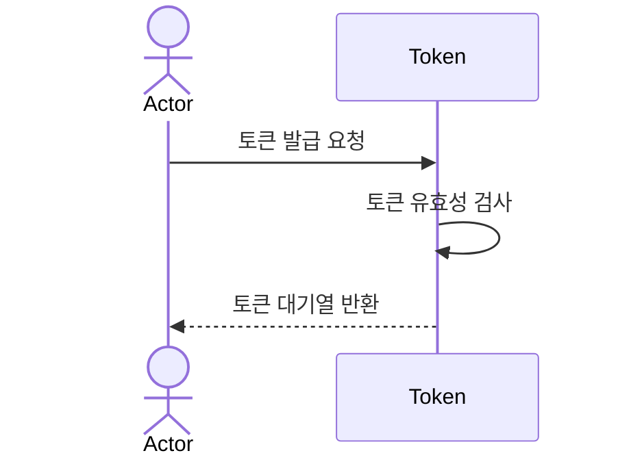
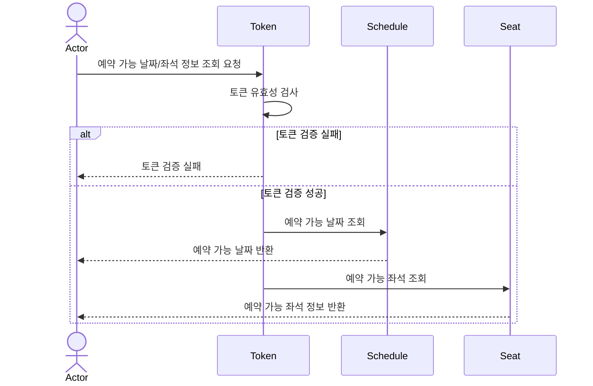
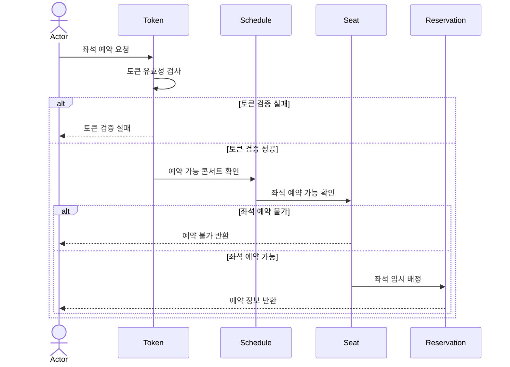
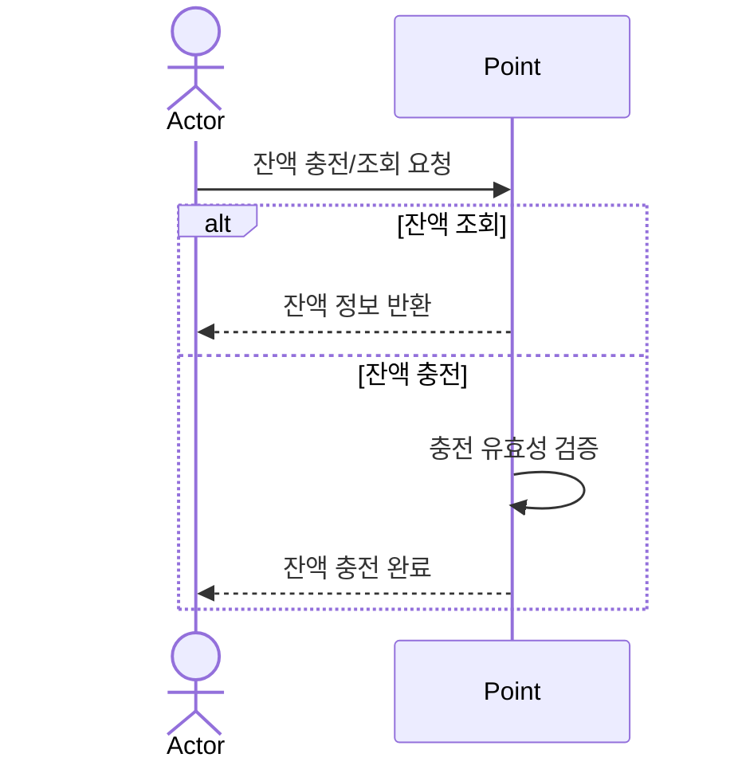
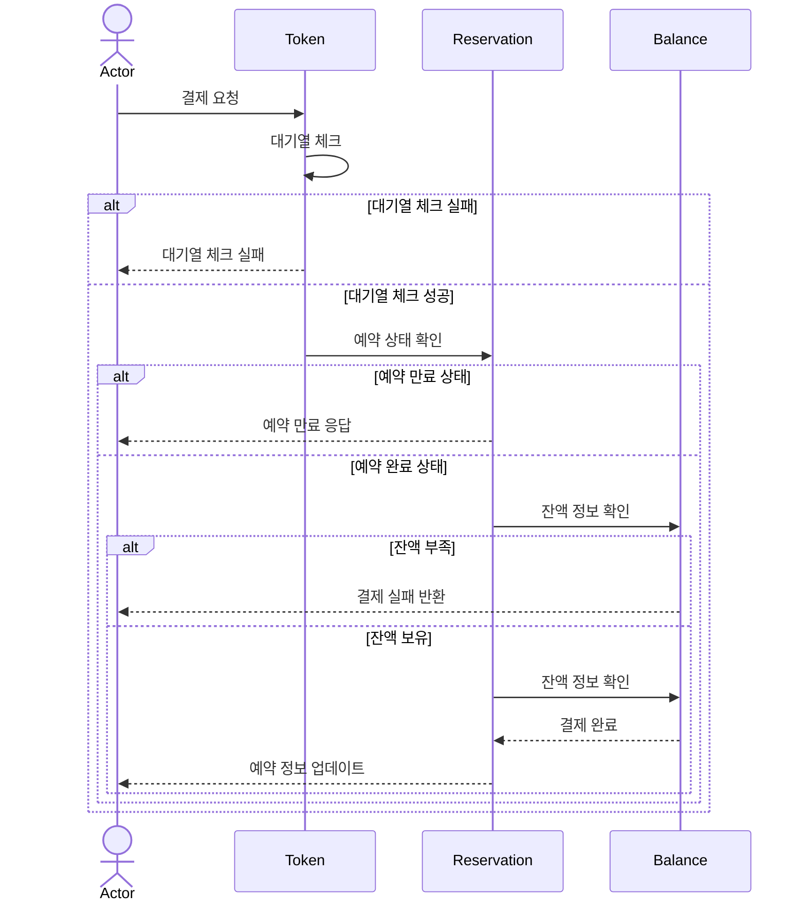
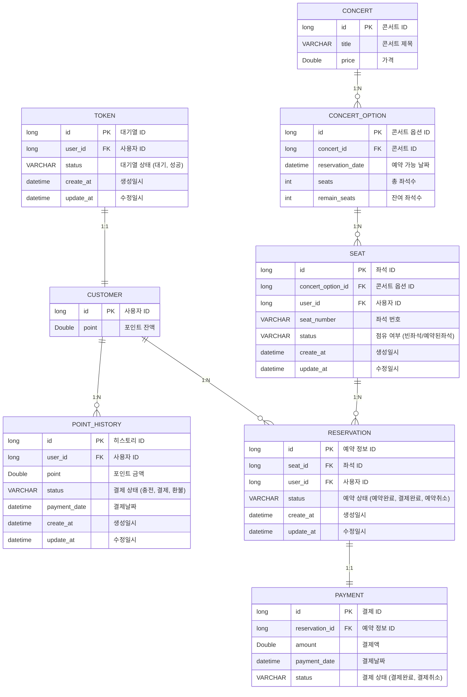

# 콘서트 예약 서비스

- 대기열 시스템을 구축하고, 예약 서비스는 작업 가능한 유저만 수행할 수 있다.
- 사용자는 좌석 예약 시 미리 충전한 잔액을 이용합니다.
- 좌석 예약 요청 시, 결제가 이루어지지 않더라도 일정 시간 동안 다른 유저가 해당 좌석에 접근할 수 없도록 합니다.

<br/>

## 주요 기능
<details>
<summary> 더보기 </summary>

**1️⃣ `주요` 유저 대기열 토큰 기능**

- 서비스를 이용할 토큰을 발급받는 API
- 토큰은 유저의 UUID 와 해당 유저의 대기열을 관리할 수 있는 정보 ( 대기 순서 or 잔여 시간 등 ) 를 포함한다.
- 이후 모든 API 는 위 토큰을 이용해 대기열 검증을 통과해야 이용 가능하다.
- 기본적으로 폴링으로 본인의 대기열을 확인한다고 가정한다.

**2️⃣ `기본` 예약 가능 날짜 / 좌석 API**

- 예약가능한 날짜와 해당 날짜의 좌석을 조회하는 API
- 예약 가능한 날짜 목록을 조회할 수 있다.
- 날짜 정보를 입력받아 예약가능한 좌석정보를 조회할 수 있다.
- 좌석 정보는 1 ~ 50 까지의 좌석번호로 관리된다.

**3️⃣ `주요` 좌석 예약 요청 API**

- 날짜와 좌석 정보를 입력받아 좌석을 예약 처리하는 API
- 좌석 예약과 동시에 해당 좌석은 그 유저에게 약 5분간 임시 배정된다. ( 시간은 정책에 따라 자율적으로 정의 )
- 만약 배정 시간 내에 결제가 완료되지 않는다면 좌석에 대한 임시 배정은 해제되어야 하며 임시배정 상태의 좌석에 대해 다른 사용자는 예약할 수 없어야 한다.

**4️⃣ `기본` 잔액 충전 / 조회 API**

- 결제에 사용될 금액을 충전하는 API
- 사용자 식별자 및 충전할 금액을 받아 잔액을 충전한다.
- 사용자 식별자를 통해 해당 사용자의 잔액을 조회한다.

**5️⃣ `주요` 결제 API**

- 결제 처리하고 결제 내역을 생성하는 API
- 결제가 완료되면 해당 좌석의 소유권을 유저에게 배정하고 대기열 토큰을 만료시킨다.

</details>

<br/>

## 패키지 구조
```
└── concert
    └── app
        └── application
            └── service
        └── domain
            └── dto
            └── repository
        └── infrastructure
            └── entity
            └── jpaRepository
        └── interfaces
            └── api
    └── config
```
- app : 비즈니스 정보를 포함하는 패키지
- config : 서버 구동을 위한 인프라스트럭쳐 정보를 포함하는 패키지

<br/>

## 기술 스택
- Language
    - Java 21
- Framework
    - Spring Boot, Jpa
- RDBMS
    - h2
- Test
    - JUnit + AssertJ
- Architecture
    - Testable Business logics
    - Layered Architecture Based (+) Clean Architecture

<br/>

## Milestone
🔗 [Milestone 확인](https://github.com/users/kimm776/projects/5/views/6)

<br/>

## FlowChart


<br/>

## Sequence Diagram

1. 유저 토큰 발급 API



<br/>

2. 예약 가능 날짜 / 좌석 API



<br/>

3. 좌석 예약 요청 API



<br/>

4. 잔액 충전 / 조회 API



<br/>

5. 결제 API



<br/>

## ERD 설계



<br/>

## API 명세
🔗 [API 명세 확인](docs%2FAPI-Specification.md)

<br/>
